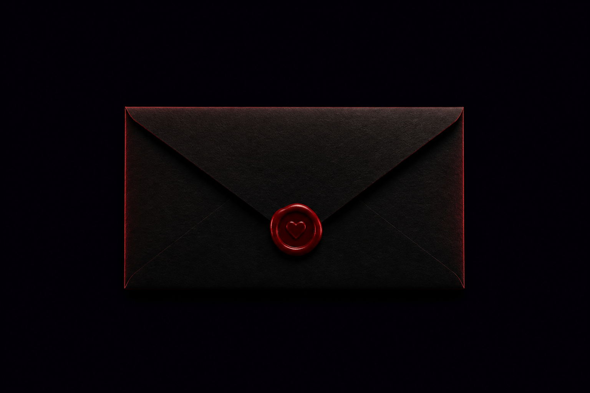

# Particle Heart · 给你的粒子爱心

一个零依赖的 WebGL 互动小作品：点击信封，一颗由上万颗发光粒子组成的 3D 爱心会在夜色中显现；再次点击页面（或按空格），爱心会爆散并重新聚合。

<p align="center">
  
</p>

<p align="center">点击信封后，进入粒子爱心互动场景。</p>

## Demo

本项目不需要构建步骤。在浏览器中直接打开 [heart-pulse/index.html](./heart-pulse/index.html) 即可体验。

也可以在项目根目录启动任意静态文件服务器，例如：

```bash
npx serve .
```

随后访问 `http://localhost:3000/heart-pulse/`。

## 互动方式

| 操作 | 效果 |
| --- | --- |
| 点击信封 | 打开信件，显现粒子爱心 |
| 移动鼠标／手指 | 让爱心随指针产生轻微动态偏移 |
| 再次点击页面 | 触发粒子爆散与重聚 |
| 空格键 | 未打开时打开信件；打开后触发爆散 |

## 亮点

- 原生 WebGL 绘制，未使用框架或第三方运行时依赖。
- 约 6,800（移动端）至 11,500（桌面端）颗爱心粒子，另含星尘背景。
- 自定义顶点与片元着色器，营造发光、呼吸和闪烁效果。
- 针对触屏、键盘操作与减少动态效果偏好做了适配。

## 项目结构

```text
.
└── heart-pulse/
    ├── index.html               # 页面结构与文案
    ├── main.js                  # WebGL 粒子、互动和动画逻辑
    ├── style.css                # 页面布局、过渡与响应式样式
    └── assets/
        └── midnight-envelope-v2.png
```

## 技术栈

HTML · CSS · JavaScript · WebGL（GLSL）

---

为某个特别的人，送上一小片宇宙。 ♥
